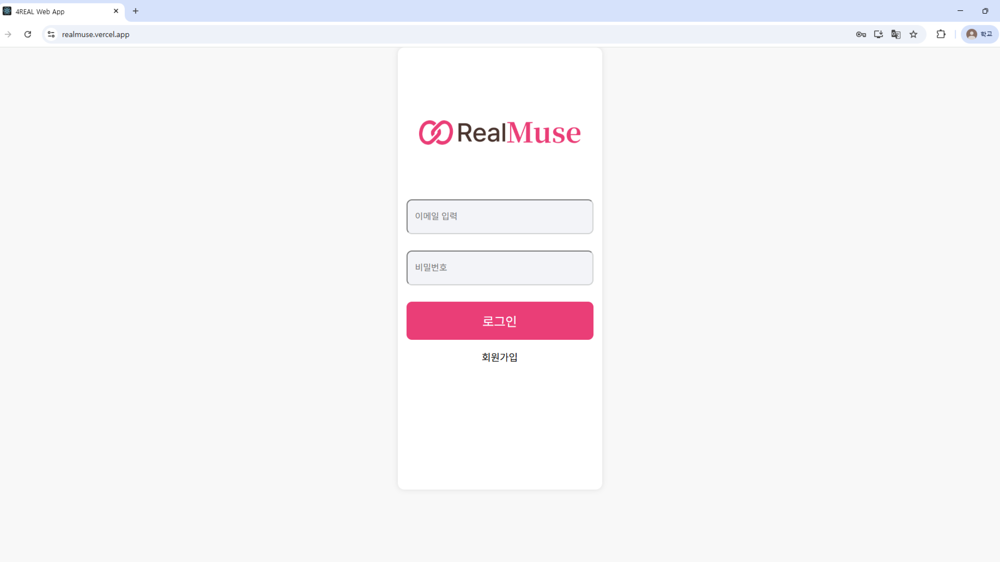
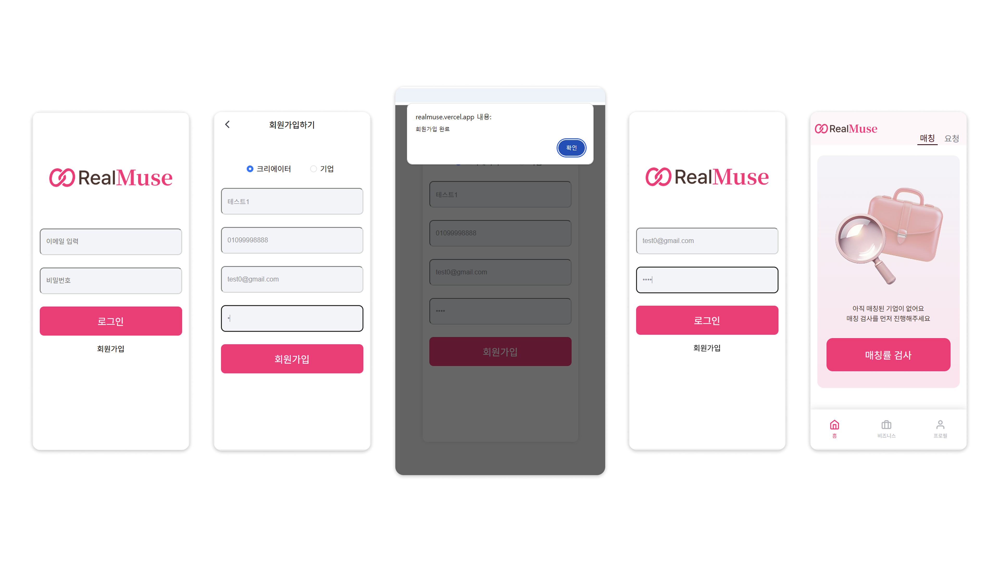
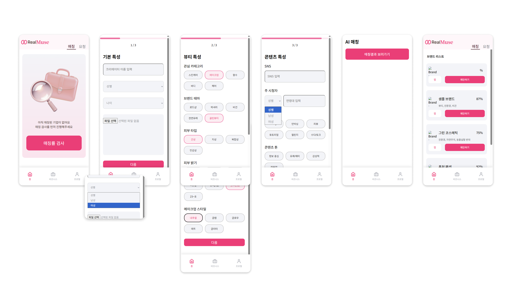
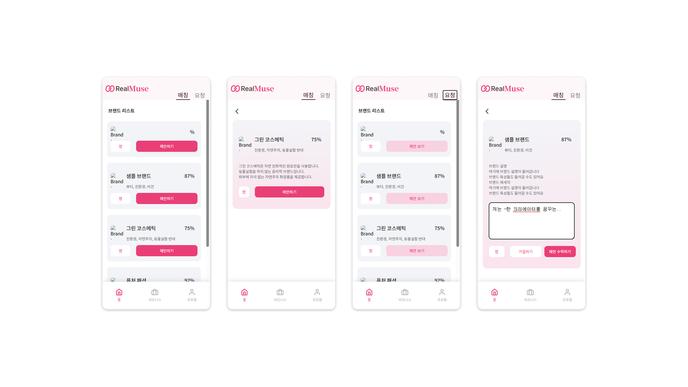

# RealMuse

### 1인 마이크로 뷰티 크리에이터와 뷰티 브랜드 매칭 플랫폼


---

## 문제 인식

### 마이크로 인플루언서의 성장 한계

- 대형 기획사 소속이 아닌 크리에이터는 브랜드와 직접 협업할 접점이 부족함
- 채널 특성에 맞는 브랜드를 찾기 어려워, 비효율적인 협찬 제안이 반복됨
- 영상 시청 수익 외에 추가적인 수익화 방법이 필요함

### 브랜드 측의 협업 파트너 발굴 어려움

- 팔로워 수보다 브랜드 정체성과 맞는 채널 세계관, 타깃층을 가진 크리에이터를 원함
- 단순 검색만으로는 크리에이터의 뷰티 특성, 콘텐츠 방향, 팬층 구성을 파악하기 어려움
- 협찬 효율을 높이기 위해 더 정교한 매칭이 필요함

---

## 핵심 기능

1. 매칭률 진단

- 크리에이터와 브랜드의 특성을 분석해, 협업 궁합을 수치로 제공

2. 쌍방향 제안 및 수락

- 간편한 버튼 클릭으로 협업 제안과 수락을 자동화

3. 안전한 계약 및 결제

- 계약서 작성, 정산 등 협업 과정을 플랫폼 내에서 안전하게 관리

---

## 사용 기술

### 프론트엔드

- 프레임워크: REACT
- 언어: TypeScript
- 스타일링: styled-components (CSS-in-JS)
- 라우팅: React Router
- API 통신: Axios, Fetch API
- 배포: GitHub 연동 Vercel을 이용한 자동 배포

### 백엔드

- 프레임워크: Spring Boot
- 언어: Java
- CI/CD 및 배포: GitHub Actions, Docker, AWS EC2
- 데이터베이스: AWS RDS(MySQL), Redis
- 스토리지: AWS S3

---

## API 연동 완료

### 로그인/회원가입

- POST https://team4real.r-e.kr/auth/login
- POST https://team4real.r-e.kr/auth/signup

### 상단바 탭 별 브랜드 리스트 (홈화면)

- 사용자가 선택한 상단바 탭(추천 매칭/받은 요청)에 따라 if문으로 각각의 API 호출
- GET https://team4real.r-e.kr/creators/matchings/recommendations
- GET https://team4real.r-e.kr/creators/matchings/requests

### 테스트 진행 및 결과

- POST https://team4real.r-e.kr/creators/analysis
- GET https://team4real.r-e.kr/creators/analysis

---

## 화면 구현

### RealMuse Vercel 배포



### 회원가입 & 로그인 후 홈 화면 진입



### 매칭률 검사 진행 후 홈 반영



### 매칭/요청 브랜드 리스트



---

## 폴더 구조

<details>
  <summary>폴더 구조 보기</summary>

```plaintext
📦src
┣ 📂assets
┃ ┣ 📂icons
┃ ┃ ┣ 📜ActiveBriefcase.png
┃ ┃ ┣ 📜ActiveHome.png
┃ ┃ ┣ 📜ActiveUser.png
┃ ┃ ┣ 📜Briefcase.png
┃ ┃ ┣ 📜Home.png
┃ ┃ ┗ 📜User.png
┃ ┣ 📜AppLogo.png
┃ ┣ 📜BackIconButton.png
┃ ┗ 📜HomeTest.png
┣ 📂bottom
┃ ┣ 📜BottomBar.style.ts
┃ ┗ 📜BottomBar.tsx
┣ 📂business
┃ ┣ 📂top
┃ ┃ ┣ 📜topbar.style.ts
┃ ┃ ┗ 📜TopBar.tsx
┃ ┗ 📜Business.tsx
┣ 📂data
┃ ┗ 📜brandDummy.ts
┣ 📂home
┃ ┣ 📂brandBox
┃ ┃ ┣ 📜brandBox.style.ts
┃ ┃ ┗ 📜BrandBox.tsx
┃ ┣ 📂brandList
┃ ┃ ┣ 📜brandlist.style.ts
┃ ┃ ┗ 📜BrandList.tsx
┃ ┣ 📂desc
┃ ┃ ┣ 📜detail.style.ts
┃ ┃ ┣ 📜RecommendationsDetail.tsx
┃ ┃ ┗ 📜RequestsDetail.tsx
┃ ┣ 📂top
┃ ┃ ┣ 📜topbar.style.ts
┃ ┃ ┗ 📜TopBar.tsx
┃ ┣ 📜home.style.ts
┃ ┗ 📜Home.tsx
┣ 📂login
┃ ┣ 📜Login.tsx
┃ ┣ 📜loginsignup.style.ts
┃ ┗ 📜SignUp.tsx
┣ 📂profile
┃ ┗ 📜Profile.tsx
┣ 📂test
┃ ┣ 📂testScreen
┃ ┃ ┣ 📜TestResult.tsx
┃ ┃ ┣ 📜TestScreen1.tsx
┃ ┃ ┣ 📜TestScreen2.tsx
┃ ┃ ┗ 📜TestScreen3.tsx
┃ ┣ 📜test.style.ts
┃ ┣ 📜Test.tsx
┃ ┗ 📜TestProgress.tsx
┣ 📜App.css
┣ 📜App.test.js
┣ 📜App.tsx
┣ 📜custom.d.ts
┣ 📜GlobalStyle.ts
┣ 📜index.css
┣ 📜index.js
┣ 📜logo.svg
┣ 📜reportWebVitals.js
┗ 📜setupTests.js
</details>
```
